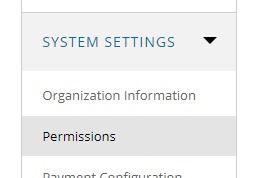
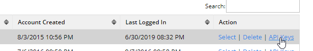
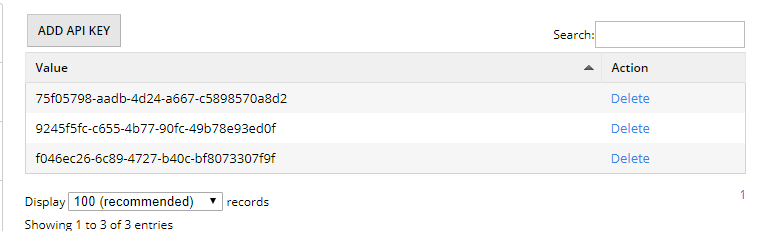
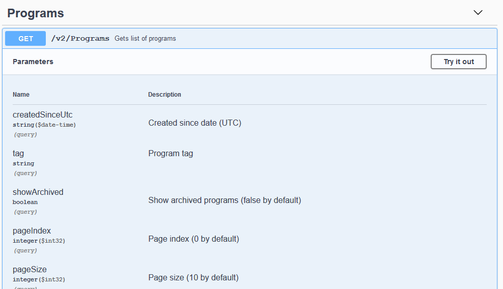
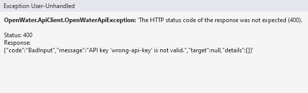

# OpenWater.ApiClient

Wrapper for getopenwater.com REST APIs. Full featured read/write API for the most popular application and review platform.

## Installation

```powershell
Install-Package OpenWater
```

If you need more info about package managment, you can read it [here](https://docs.microsoft.com/ru-ru/nuget/consume-packages/install-use-packages-powershell).

## Getting Started

OpenWater provides a mechanism for managing the entire program life cycle via API.  You or your development team can create
users, submit to programs, forward to rounds, assign judges, update fields, and pull data all via our REST api.

In order to authenticate to the API you must generate an API key.  To do so go to **System Settings > Permissions**



The API operates under the privileges of an admin user, either create a user for API access or choose an existing user.  Choose the **API Keys option**.



Add one or more API keys that tie to this user.  If an API key is no longer needed or you believe it is compromised, you should delete it.



## Usage

Before using client, you should setup API throttling values. For example, you want to use 100 requests per second and  5 simultaneous requests:

```csharp
OpenWaterHttpClient.NumberOfRequestsPerSecond = 100;
OpenWaterHttpClient.NumberOfSimultaneousRequests = 5;

const string host = "demo.secure-platform.com";
const string apiKey = "some api key";
const string baseUrl = "https://api.secure-platform.com";

var api = new OpenWaterApiClient(host, apiKey, baseUrl: baseUrl);
```

You can also pass `HttpClient`, organizationCode and email suppressing flag as a constructor parameter.

```csharp
const string orgCode = "main";
const bool suppressEmails = true;

var httpClient = new HttpClient();

var api = new OpenWaterApiClient(host, apiKey, baseUrl: baseUrl, httpClient: httpClient, organizationCode: orgCode, suppressEmails: suppressEmails);
```

## Examples

[Applications samples](OpenWater.ApiClient.Samples/ApplicationSamples.cs)

* Create new application
* Get application created in last 24 hours
* Update application data
* Update application category
* Upload media file via Url and update submission form media field
* Update application category
* Update application status from pending approval to complete
* Update application to allow user to make edits
* Assign Winner
* Forward to Next Round
* Add Collaborator
* Remove Collaborator from Submission
* View all new applications created or modified in last week
* View Deleted Applications in Last Week
* Upload media file via Url and update submission form media field
* Update application category
* Update application status from pending approval to complete
* Update application to allow user to make edits
* Assign Winner
* Forward to Next Round
* Add Collaborator
* Remove Collaborator to Submission
* View all new applications created or modified in last week
* View Deleted Applications in Last Week

[Evaluation samples](OpenWater.ApiClient.Samples/EvaluationSamples.cs)

* Get Evaluation by Application Id and Judge Email and Round Id
* Update Evaluation

[Invoice samples](OpenWater.ApiClient.Samples/InvoiceSamples.cs)

* Get all invoices in last week
* Get Invoice by id
* Get all billing line items since last week
* Get all payments since last week
* Get all refunds since last week

[Judge assignment samples](OpenWater.ApiClient.Samples/JudgeAssignmentSamples.cs)

* Get all Current Judge Assignments for Application
* Assign Judge to Application
* Remove Judge form Application
* Add Judge to Team
* Remove Judge from Team
* Get all Judges on Team

[Report Runner samples](OpenWater.ApiClient.Samples/ReportRunnerSamples.cs)

* Run Background Job with ID, wait until complete, and show Url of JSON file

[Session chair samples](OpenWater.ApiClient.Samples/SessionChairSamples.cs)

* Add Session Chair to Session
* Remove Session Chair

[Session samples](OpenWater.ApiClient.Samples/SessionSamples.cs)

* Create Session
* Update Session Fields
* Delete Session
* Get Sessions Created or Modified in Last week
* Get Session Data by Id

[User samples](OpenWater.ApiClient.Samples/UserSamples.cs)

* Create User
* Get all users
* Get user by name
* Get users with pagination
* Create User and Get that User
* Create User and Update that user's profile
* Update User profile
* Get Sso Url for a User by their email address

### How to find needed endpoint

Just use [our swagger specification](https://api.secure-platform.com/swagger/index.html). For example, **Get Programs**



ApiClient provides `async` and `sync` methods. We recommend to use `async`.

```csharp
var applications = await ApiClient.ApplicationListAsync(startedAtUtc: DateTimeOffset.UtcNow.AddDays(-1));

applications.Items.ToList()
  .ForEach(a => Console.WriteLine("Id: {0}; Program id: {1}", a.Id, a.ProgramId));
```

## Exceptions

ApiClient provides exception class `OpenWater.ApiClient.OpenWaterApiException`.



## License

[MIT](https://choosealicense.com/licenses/mit/)
